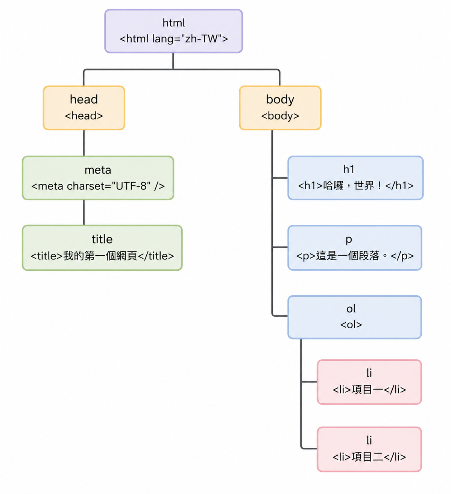

<!-- .slide: class="cover" -->

# 程式設計概論
# Static Web Page

## 許智超

<hr>

cchsu@mail.nsysu.edu.tw

---

<!-- .slide: class="section-page" -->

<div class="num">01</div>

## 靜態網頁是什麼？

<hr>

先搞清楚我們在做什麼

---

<!-- .slide: class="cols" -->

### 靜態 vs 動態網頁

<hr>

<div class="col-wrap">
<div class="col alt">

**靜態網頁**

- 內容寫死在檔案裡
- 不需要後端伺服器運算
- 檔案直接丟給瀏覽器
- 範例：個人作品集、說明頁

</div>
<div class="col alt">

**動態網頁**

- 內容來自資料庫或 API
- 需要後端語言（PHP、Python…）
- 每次請求都重新產生頁面
- 範例：Facebook、Gmail

</div>
</div>

Notes: 靜態網頁雖然「靜態」，但 JavaScript 仍可讓它有豐富的互動效果！

---

<!-- .slide: class="stats" -->

### 網頁三要素：HTML, CSS, Javascript

<hr>


<div class="stat-wrap">
<div class="stat">

**HTML**

結構與內容

<div style="text-align: left">

- 告訴瀏覽器「這裡有什麼」
- 標題、段落、圖片、按鈕…
- 像房子的**骨架與牆壁**
</div>

</div>
<div class="stat">

**CSS**

樣式與外觀

<div style="text-align: left">

- 告訴瀏覽器「長什麼樣子」
- 顏色、字型、排版、動畫…
- 像房子的**裝潢與油漆**
</div>
</div>
<div class="stat">

**JavaScript**

行為與互動

<div style="text-align: left">

- 告訴瀏覽器「做什麼事」
- 點擊、計算、更新畫面…
- 像房子的**電路與機關**
</div>

</div>
</div>


Notes: 三者分工合作——HTML 定義內容，CSS 負責呈現，JS 處理邏輯。初學時三個都寫在同一個 .html 檔最方便。

---

### 網頁三要素：HTML, CSS, Javascript

<hr>

```html
<!DOCTYPE html>
<html lang="zh-TW">
  <head>
    <meta charset="UTF-8">
    <title>我的網頁</title>
    <style>
      /* CSS 寫在這裡 */
    </style>
  </head>
  <body>
    <!-- HTML 結構寫在這裡 -->

    <script>
      // JavaScript 寫在這裡
    </script>
  </body>
</html>
```

Notes: 實際專案會拆成三個獨立檔案，但初學階段單一檔案更容易上手、方便對照學習。

---

<!-- .slide: class="section-page" -->

<div class="num">02</div>

## HTML

<hr>

HyperText Markup Language — 超文字標記語言

---

<!-- .slide: class="cols" -->

### HTML 的由來與發展

<hr>

<div class="col-wrap">
<div class="col alt">

**起源**

- 1989 年，Tim Berners-Lee 在 CERN 提出
- 1991 年，HTML 1.0 公開發布
- 目的：讓科學家能透過網路分享文件
- 語法靈感來自 SGML（文件標記語言）

</div>
<div class="col alt">

**重要版本里程碑**

| 年份 | 版本 |
|------|------|
| 1995 | HTML 2.0（首個正式標準） |
| 1997 | HTML 3.2 / 4.0 |
| 2000 | XHTML 1.0（嚴格語法） |
| 2014 | **HTML5**（現行標準） |

</div>
</div>

Notes: HTML5 由 WHATWG 與 W3C 共同維護，引入了 video、canvas、語意標籤等現代功能，大幅降低對 Flash 的依賴。

---

<!-- .slide: class="text-image" -->

<div class="ti-left">

### HTML 基本結構

<hr>

```html
<!DOCTYPE html>
<html lang="zh-TW">
  <head>
    <meta charset="UTF-8" />
    <title>我的第一個網頁</title>
  </head>
  <body>
    <h1>哈囉，世界！</h1>
    <p>這是一個段落。</p>
    <ol>
      <li>項目一</li>
      <li>項目二</li>
    </ol>
  </body>
</html>
```

Notes: head 放設定與 CSS；body 放內容；script 擺在 body 底部，確保上方的 HTML 元素已載入完畢。

</div>
<div class="ti-right">


<!-- .element: style="width: 80%;" -->

</div>

---

### 常用 HTML 標籤

<hr>

| 標籤 | 用途 | 範例 |
|------|------|------|
| `<h1>`～`<h6>` | 標題（由大到小） | `<h1>大標題</h1>` |
| `<p>` | 段落文字 | `<p>一段話</p>` |
| `<a>` | 超連結 | `<a href="...">點我</a>` |
| `` | 圖片 | `` |
| `<ul>` / `<li>` | 無序清單 | `<ul><li>項目</li></ul>` |
| `<div>` | 區塊容器 | `<div>...</div>` |
| `<button>` | 按鈕 | `<button>送出</button>` |
| `<input>` | 輸入框 | `<input type="text">` |

---

<!-- .slide: class="section-page" -->

<div class="num">03</div>

## CSS

<hr>

Cascading Style Sheets — 層疊樣式表

---

### CSS 基本語法

<hr>

```css
/* 選擇器 { 屬性: 值; } */
/* tag 選擇器 */
h1 {
  color: #1a73e8;      /* 文字顏色 */
  font-size: 48px;     /* 字體大小 */
  text-align: center;  /* 置中對齊 */
}
/* class 選擇器 */
.highlight {
  background: yellow;
  padding: 8px 16px;
}
/* id 選擇器 */
#main-btn {
  background: #1a73e8;
  color: white;
  border-radius: 8px;
}
```

Notes: 選擇器有三種：tag、.class、#id，優先級依序提高。

---

### CSS 常用屬性速查

<hr>

<div class="col-wrap">
<div class="col">

## 文字樣式

- `color` — 文字顏色
- `font-size` — 字體大小
- `font-weight` — 粗體
- `text-align` — 對齊方式
- `line-height` — 行距

</div>
<div class="col alt">

## 盒子模型

- `width / height` — 寬高
- `margin` — 外距
- `padding` — 內距
- `border` — 邊框
- `background` — 背景色
- `border-radius` — 圓角

</div>
</div>

---

<!-- .slide: class="section-page" -->

<div class="num">04</div>

## JavaScript

<hr>

讓網頁動起來的程式語言

---

### JavaScript 的故事

<hr>

<div class="two-col">
<div>

> **1995 年**
> Brendan Eich 在 **10 天**內創造出這門語言

> **原名 Mocha → LiveScript**
> 為了搭 Java 熱潮，改名為 **JavaScript**
> ⚠️ 和 Java **完全沒有關係**

> **1997 年**
> 成為 ECMAScript 國際標準，各瀏覽器開始支援

</div>
<div>

> **2009 年**
> Node.js 讓 JavaScript 走出瀏覽器、進入伺服器

> **2015 年（ES6）**
> 語法大幅現代化，成為主流程式語言

> **今天**
> 世界上使用人數最多的程式語言之一

</div>
</div>

Notes: 強調「10 天」的趣事，以及 JavaScript 和 Java 名字相似但完全不同這點，學生常常搞混。

---

### JavaScript 能做什麼？

<hr>

> **操作頁面內容**
> 讀取或修改 HTML 元素的文字、樣式、屬性

> **回應使用者操作**
> 監聽點擊、輸入、滾動等事件並執行動作

> **計算與邏輯處理**
> 條件判斷、迴圈、數學運算、字串處理

> **與伺服器溝通**
> 透過 `fetch()` 取得或送出資料（AJAX）

Notes: 前三項是靜態網頁最常用的能力，今天主要介紹這些。

---

<!-- .slide: class="section-page" -->

<div class="num">04-1</div>

## JavaScript 基礎語法

<hr>

從變數開始學起

---

### 變數宣告

<hr>

```javascript
// let — 可以重新賦值的變數（推薦）
let name = "Alice";
let age = 20;

// const — 宣告後不能再改的常數（推薦）
const PI = 3.14159;
const SITE_NAME = "我的網站";

// var — 舊寫法，避免使用
var oldStyle = "不推薦";

// 重新賦值
name = "Bob";   // let 可以改
// PI = 3;      // const 不能改，會報錯
```

Notes: 現代 JS 盡量用 const，需要改值才用 let，避免用 var。

---

### 資料型別

<hr>

```javascript
// 字串 (String)
let greeting = "哈囉！";
let template = `你好，${name}！`;  // 樣板字串（反引號）

// 數字 (Number)
let score = 95;
let price = 19.99;

// 布林值 (Boolean)
let isLoggedIn = true;
let isEmpty = false;

// 陣列 (Array)
let fruits = ["蘋果", "香蕉", "芒果"];
console.log(fruits[0]);  // → "蘋果"

// 物件 (Object)
let student = { name: "Alice", age: 20, grade: "A" };
console.log(student.name);  // → "Alice"
```

---

### 運算子

<hr>

```javascript
// 算術運算子
let a = 10, b = 3;
console.log(a + b);   // 13
console.log(a - b);   // 7
console.log(a * b);   // 30
console.log(a / b);   // 3.333...
console.log(a % b);   // 1  ← 餘數

// 比較運算子（回傳 true / false）
console.log(5 === 5);   // true  ← 嚴格相等（推薦）
console.log(5 !== 3);   // true
console.log(10 > 5);    // true
console.log(3 <= 3);    // true

// 邏輯運算子
console.log(true && false);  // false（且）
console.log(true || false);  // true（或）
console.log(!true);          // false（非）
```

Notes: 用 === 而非 ==，避免型別自動轉換的陷阱。

---

### 條件判斷

<hr>

```javascript
let score = 75;

// if / else if / else
if (score >= 90) {
  console.log("優秀！A");
} else if (score >= 80) {
  console.log("良好！B");
} else if (score >= 70) {
  console.log("及格！C");
} else {
  console.log("需要加油！");
}
// → 輸出：及格！C

// 三元運算子（簡短版）
let status = score >= 60 ? "通過" : "不通過";
console.log(status);  // → "通過"
```

---

### 迴圈

<hr>

```javascript
// for 迴圈
for (let i = 1; i <= 5; i++) {
  console.log(`第 ${i} 次`);
}
// → 第 1 次、第 2 次 … 第 5 次

// while 迴圈
let count = 0;
while (count < 3) {
  console.log("count =", count);
  count++;
}

// 陣列遍歷（最常用）
let colors = ["紅", "綠", "藍"];

colors.forEach(function(color) {
  console.log(color);
});

// 箭頭函式簡寫（現代寫法）
colors.forEach(color => console.log(color));
```

---

### 函式

<hr>

```javascript
// 函式宣告
function greet(name) {
  return `你好，${name}！`;
}
console.log(greet("Alice"));  // → 你好，Alice！

// 有預設值的參數
function add(a, b = 0) {
  return a + b;
}
console.log(add(5, 3));  // → 8
console.log(add(5));     // → 5

// 箭頭函式（Arrow Function）
const multiply = (x, y) => x * y;
console.log(multiply(4, 3));  // → 12

// 呼叫自己寫的函式
function square(n) {
  return n * n;
}
console.log(square(7));  // → 49
```

Notes: 箭頭函式是現代 JS 常見寫法，特別是在 callback 裡。

---

<!-- .slide: class="section-page" -->

<div class="num">04-2</div>

## 操作網頁元素

<hr>

DOM — Document Object Model

---

### 什麼是 DOM？

<hr>

> 瀏覽器把 HTML 解析成一棵「樹狀結構」，JavaScript 可以透過 DOM API 讀取或修改每個節點。

```html
<!-- HTML -->
<h1 id="title">原始標題</h1>
<p class="info">一段文字</p>
<button id="btn">點我</button>
```

```javascript
// 用 id 選取元素
const title = document.getElementById("title");

// 用 CSS 選擇器選取（更靈活，推薦）
const info  = document.querySelector(".info");
const btn   = document.querySelector("#btn");

// 選取多個元素 → 回傳陣列
const allItems = document.querySelectorAll("li");
```

---

### 修改元素內容與樣式

<hr>

```javascript
const title = document.querySelector("#title");

// 修改文字內容
title.textContent = "新標題！";

// 修改 HTML 內容（可放標籤）
title.innerHTML = "<em>斜體新標題</em>";

// 修改 CSS 樣式
title.style.color = "red";
title.style.fontSize = "60px";

// 新增 / 移除 CSS class（更乾淨的做法）
title.classList.add("highlight");
title.classList.remove("highlight");
title.classList.toggle("active");  // 有就移除、沒有就新增

// 讀取 / 修改屬性
const img = document.querySelector("img");
img.getAttribute("src");          // 讀取
img.setAttribute("src", "new.jpg"); // 修改
```

---

### 事件監聽

<hr>

```javascript
const btn = document.querySelector("#btn");

// addEventListener(事件名稱, 處理函式)
btn.addEventListener("click", function() {
  alert("你點到按鈕了！");
});

// 箭頭函式寫法
btn.addEventListener("click", () => {
  console.log("被點擊！");
});

// 常用事件
// "click"      — 點擊
// "mouseover"  — 滑鼠移入
// "mouseout"   — 滑鼠移出
// "input"      — 輸入框內容改變
// "keydown"    — 按下鍵盤
// "submit"     — 表單送出
// "load"       — 頁面載入完成
```

---

<!-- .slide: class="section-page" -->

<div class="num">04-3</div>

## JSON

<hr>

JavaScript Object Notation — 輕量的資料交換格式

---

### 什麼是 JSON？

<hr>

- **純文字格式**，用來表示結構化資料
- 語法來自 JavaScript 物件，但**任何語言都能讀寫**
- 副檔名 `.json`，或作為 API 回傳的資料格式

```json
{
  "name": "Alice",
  "age": 20,
  "isStudent": true,
  "courses": ["數學", "程式設計", "英文"],
  "address": {
    "city": "高雄",
    "zip": "804"
  }
}
```

Notes: JSON 是現代前後端溝通最普遍的格式，幾乎所有 Web API 都用 JSON 回傳資料。

---

### JSON 語法規則

<hr>

<div class="col-wrap">
<div class="col alt">

**合法 JSON**

```json
{
  "name": "Alice",
  "age": 20,
  "active": true,
  "tags": ["web", "js"],
  "extra": null
}
```

</div>
<div class="col alt">

**常見錯誤**

```json
{
  name: "Alice",       // ✗ 鍵名沒有引號
  "age": 20,
  "active": true,
  "note": undefined,   // ✗ 不支援 undefined
  // 這是註解       // ✗ 不支援註解
}
```

</div>
</div>

Notes: JSON 的鍵名一定要用雙引號，值只能是字串、數字、布林、陣列、物件、null 六種類型。

---

### JSON.stringify() 與 JSON.parse()

<hr>

```javascript
// JS 物件 → JSON 字串（用於儲存或傳送）
const student = { name: "Alice", age: 20, courses: ["數學", "程式"] };
const jsonStr = JSON.stringify(student);
console.log(jsonStr);
// → '{"name":"Alice","age":20,"courses":["數學","程式"]}'
console.log(typeof jsonStr);  // → "string"

// JSON 字串 → JS 物件（用於讀取或接收）
const obj = JSON.parse(jsonStr);
console.log(obj.name);        // → "Alice"
console.log(obj.courses[0]);  // → "數學"
console.log(typeof obj);      // → "object"

// 加上縮排，方便閱讀（第三個參數）
console.log(JSON.stringify(student, null, 2));
```

Notes: stringify 把物件「打包成字串」才能存進 localStorage 或透過網路傳送；parse 則是「解包」還原成物件。

---

<!-- .slide: class="section-page" -->

<div class="num">04-4</div>

## 瀏覽器儲存：LocalStorage

<hr>

網頁關掉再開，資料還在！

---

### 什麼是 LocalStorage？

<hr>

> 瀏覽器送給你的一個「小型私人儲物櫃」

- HTML5 內建的**鍵值儲存空間**，資料存在使用者的瀏覽器裡
- 關閉分頁、重新整理、甚至重開電腦後，資料**不會消失**
- 不需要透過網路向伺服器索取，直接在瀏覽器端讀寫

Notes: 這是一種 client-side storage，完全不依賴後端，非常適合靜態網頁使用。

---

### 為什麼需要 LocalStorage？

<hr>

以購物網站的購物車為例：

<div class="col-wrap">
<div class="col alt">

**沒有 LocalStorage**

商品加入購物車，一重新整理頁面

→ 購物車**清空了**

</div>
<div class="col alt">

**有了 LocalStorage**

選好的商品偷偷存進儲物櫃，下次再開網站

→ **自動恢復**購物車狀態

</div>
</div>

Notes: 除了購物車，常見應用還有：記住深色/淺色主題設定、記住使用者名稱、暫存表單草稿等。

---

### LocalStorage 的核心特點

<hr>

- **永久性** — 沒有過期時間，只要不主動刪除就會一直存在
- **容量限制** — 約 **5 MB**，適合設定、偏好、暫存資料，不能存大型檔案
- **字串格式** — 只能存字串；物件或陣列需先用 `JSON.stringify()` 轉換
- **網域隔離** — 網站 A 的資料，網站 B 完全讀不到，保護使用者隱私

---

### LocalStorage 基本操作

<hr>

```javascript
// 寫入
localStorage.setItem("username", "Alice");
localStorage.setItem("theme", "dark");

// 讀取（key 不存在時回傳 null）
const name  = localStorage.getItem("username"); // "Alice"
const theme = localStorage.getItem("theme");    // "dark"

// 刪除單筆 / 清除全部
localStorage.removeItem("theme");
localStorage.clear();

// 儲存物件：先轉成 JSON 字串
const user = { name: "Alice", age: 20 };
localStorage.setItem("user", JSON.stringify(user));

// 讀取物件：再從 JSON 字串還原
const loaded = JSON.parse(localStorage.getItem("user"));
```

Notes: DevTools → Application → Local Storage 可以查看目前存了哪些資料，也可以手動刪除。

---

### 與其他儲存方式的比較

<hr>

| 類型 | 生命週期 | 容量 | 常見用途 |
|------|---------|------|---------|
| **LocalStorage** | 永久（手動刪除才消失） | ~5 MB | 深色模式、長期購物車 |
| **SessionStorage** | 關閉分頁後自動刪除 | ~5 MB | 單次登入狀態、表單暫存 |
| **Cookies** | 可設定過期時間 | ~4 KB | 登入 Token、廣告追蹤 |

Notes: Cookies 因為容量小、且每次 HTTP 請求都會帶上，主要用於伺服器需要知道的資訊（如登入狀態）。靜態網頁通常用 LocalStorage 就夠了。

---

### 安全警告

<hr>

> **千萬不要**在 LocalStorage 裡儲存密碼、信用卡號或其他敏感資訊

- 任何執行在該頁面的 JavaScript **都能讀取**到這些資料
- 若網站存在 **XSS 漏洞**，攻擊者可輕易竊取全部內容
- LocalStorage 適合存**非敏感**的偏好設定或暫存資料

Notes: XSS（Cross-Site Scripting）是最常見的網頁安全漏洞之一，攻擊者注入惡意 JS 後可直接呼叫 localStorage.getItem() 竊取資料。

---

<!-- .slide: class="section-page" -->

<div class="num">05</div>

## 綜合實作範例

<hr>

把三個技術組合在一起

---

### 範例：計數器

<hr>

```html
<!DOCTYPE html>
<html lang="zh-TW">
<head>
  <meta charset="UTF-8">
  <title>計數器</title>
  <style>
    h2     { font-size: 80px; text-align: center; }
    button { font-size: 24px; padding: 8px 20px; margin: 4px; }
  </style>
</head>
<body>
  <h2 id="display">0</h2>
  <button id="minus">－</button>
  <button id="plus">＋</button>
  <button id="reset">重設</button>

  <script>
    let count = 0;
    const display = document.querySelector("#display");

    document.querySelector("#plus").addEventListener("click", () => {
      count++;
      display.textContent = count;
    });
    document.querySelector("#minus").addEventListener("click", () => {
      count--;
      display.textContent = count;
    });
    document.querySelector("#reset").addEventListener("click", () => {
      count = 0;
      display.textContent = count;
    });
  </script>
</body>
</html>
```

Notes: 存成 index.html，直接用瀏覽器開啟就能執行，不需要任何伺服器。

---

### 範例：待辦清單（To-Do List）+ LocalStorage

<hr>

```html
<!DOCTYPE html>
<html lang="zh-TW">
<head>
  <meta charset="UTF-8">
  <title>待辦清單</title>
  <style>
    li { cursor: pointer; padding: 4px 0; }
    li:hover { text-decoration: line-through; color: gray; }
  </style>
</head>
<body>
  <input id="task-input" type="text" placeholder="輸入待辦事項">
  <button id="add-btn">新增</button>
  <ul id="task-list"></ul>

  <script>
    const input  = document.querySelector("#task-input");
    const addBtn = document.querySelector("#add-btn");
    const list   = document.querySelector("#task-list");

    function saveTasks() {
      const tasks = [...list.querySelectorAll("li")].map(li => li.textContent);
      localStorage.setItem("tasks", JSON.stringify(tasks));
    }

    function addTask(text) {
      const li = document.createElement("li");
      li.textContent = text;
      li.addEventListener("click", () => { li.remove(); saveTasks(); }); // 點擊刪除
      list.appendChild(li);
    }

    // 頁面載入時還原儲存的清單
    JSON.parse(localStorage.getItem("tasks") || "[]").forEach(addTask);

    addBtn.addEventListener("click", () => {
      const text = input.value.trim();
      if (text === "") return;       // 空白不新增
      addTask(text);
      saveTasks();
      input.value = "";              // 清空輸入框
    });
  </script>
</body>
</html>
```

Notes: 加入 localStorage 後，重新整理頁面清單仍會保留。這是 LocalStorage 最常見的應用場景之一。

---

### 開發者工具 DevTools

<hr>

> **Console**
> 執行 JS 指令、查看 `console.log()` 輸出、除錯

> **Elements**
> 即時查看與修改 HTML 結構和 CSS 樣式

> **Sources**
> 查看 JS 原始碼，設定中斷點 (breakpoint) 一行一行 debug

> **Network**
> 監看網路請求，查看載入的檔案與時間

開啟方式：`F12` 或 右鍵 → 「檢查」

Notes: DevTools 是前端開發者最重要的工具，從第一天就應該學會使用 Console。

---

<!-- .slide: class="stats" -->

### 今天學到的

<hr>

<div class="stat-wrap">
<div class="stat">
<span class="n">HTML</span>
<hr>
<span class="l">結構與內容</span>
</div>
<div class="stat hi">
<span class="n">CSS</span>
<hr>
<span class="l">樣式與外觀</span>
</div>
<div class="stat">
<span class="n">JS</span>
<hr>
<span class="l">互動與邏輯</span>
</div>
</div>

---

### 下一步怎麼練習？

<hr>

- **動手寫** — 打開 VS Code，從 `index.html` + `style.css` + `script.js` 開始
- **用 DevTools** — 按 `F12` 在 Console 貼上 JS 程式碼立即執行
- **模仿改造** — 找一個喜歡的網站，試著用三個檔案重現它的某個區塊
- **線上資源** — MDN Web Docs（mozilla.org/zh-TW）是最可靠的參考手冊

> **記住：**
> 寫程式不是在「背語法」，是在練習「解決問題的思路」

---

<!-- .slide: class="closing" -->

### 謝謝大家！

<hr>

有任何問題歡迎發問

聯絡：imchihchao@gmail.com
